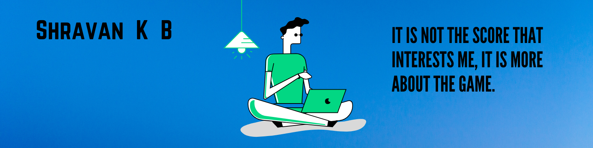

<samp>
<p align="center">
  <h1 align="center">Hey there! 👋  </h1>
</p>

<p align="center">
  
  <br>
  <h5 align="center">console.log('Forever Explorer');</h5>
</p>

<p align="center">
  
</p>


<br>

- 🔭 I possess a solid foundation and showcase a robust skill set in `Java`, `JavaScript`, `Python`, and `C++`, complemented by experience in `Node.js`, `Express.js`, `Spring`, `SpringBoot`, `Django`, and `Flask` frameworks.
  
- 🐾 Exploring every nook and corner of the Data Science domain; I find it quite interesting in terms of problem-solving.
  
- 🌱 Gaining developmental experience in Data Science and Microservices.
  
- 👯 I’m looking to collaborate and work on new Open Source / Data Science projects.
  
- 📫 How to reach me: `shravan@ohmyscript.com`
  
- ⚡ Fun fact: Brain is forever a nerd.

<br><br>

<table align="center">
  <tr>
    <td>
      <a title="Portfolio" href="https://ohmyscript.com/">
        
      </a>
    </td>
    <td>
      <a title="DEV.to" href="https://dev.to/shravan20">
        
      </a>
    </td>
    <td>
      <a title="Medium" href="https://medium.com/@shravan20">
        
      </a>
    </td>
    <td>
      <a title="LinkedIn" href="https://www.linkedin.com/in/shravan20/">
        
      </a>
    </td>
    <td>
      <a title="Email" href="mailto:shravan@ohmyscript.com">
        
      </a>
    </td>
    <td>
      <a title="Stackoverflow" href="https://stackoverflow.com/users/11899809/shravan20">
        
      </a>
    </td>
    <td>
      <a title="Twitter" href="https://x.com/shravan20_">
        
      </a>
    </td>
    <td>
      <a title="Calendly" href="https://cal.com/shravan20">
        
      </a>
    </td>
</table>

<br>

<p align="center">
  <a href="https://github.com/shravan20" target="_blank">
    
  </a>
  
  <a href="https://nervous-spruce-c3486.netlify.app/" target="_blank">
    
  </a>

  
</p>


<br>

---


#### 💌 Subscribe to My Weekly Technical Newsletter


<p align="center">
<a href="https://newsletter.ohmyscript.com/" target="_blank"></a>
</p>

---

#### ⚡ Technologies

These are some of the technologies and tools that I work with:

<table style="width:100%">
 <tr>
    <th>Programming Languages</th>
    <td> 
      
      
            
      
      
      
            
   </td>
  </tr>
  <tr>
    <th>Frameworks</th>
    <td>
      
      
      
      
    </td>
  </tr>
  <tr>
    <th>Databases</th>
    <td>
      
      
      
      
      
    </td>
  </tr>
  <tr>
    <th>Hosting/SaaS/PaaS</th>
    <td>
      
      
    </td>
  </tr>
  <tr>
    <th>Automate, Deploy, Platform & Tools</th>
    <td>
      
      
       
       
      
    </td>
  </tr>
  <tr>
    <th>Testing</th>
    <td>
      
      
    </td>
  </tr>
  <tr>
    <th>Operating Systems</th>
    <td>
      
      
      
    </td>
  </tr>
  <tr>
    <th>Markup/Markdown</th>
    <td>
      
      
      
    </td>
  </tr>
  <tr>
    <th>Others</th>
    <td>
      
      
    </td>
  </tr>
  
</table>


<p align="center">
  
</p>


---

####  My OS Projects  

```javascript
console.log(`Feel free to contribute`);
```

<table>
  <tr>
    <td>
      <a href="https://github.com/shravan20/LearningResources">
        
      </a>
    </td>
    <td>
      <a href="https://github.com/shravan20/github-readme-quotes">
        
      </a>
    </td>
  </tr>
  <tr>
    <td>
      <a href="https://github.com/shravan20/software-installation-guides">
        
      </a>
    </td>
    <td>
      <a href="https://github.com/idodav/sharkio">
        
      </a>
    </td>
  </tr>
</table>


<br>


---

#### :octocat:  My Github Stats

<table align="center">
  <tr>
    <td align="center">
      <a href="https://github.com/shravan20">
        
      </a>
    </td>
  </tr>
  <tr>
    <td align="center">
      <a href="https://github.com/shravan20">
        
      </a>
    </td>
  </tr>
</table>


---

#### :lotus_position_man: My Thoughts

<p align="center">
  
</p>


---

<p align="center">
  <h5 align="center"> Staying Motivated </h5>
</p>

<p align="center">
<a href="https://www.buymeacoffee.com/shravan20" target="_blank"></a>
</p>

---

</samp>
